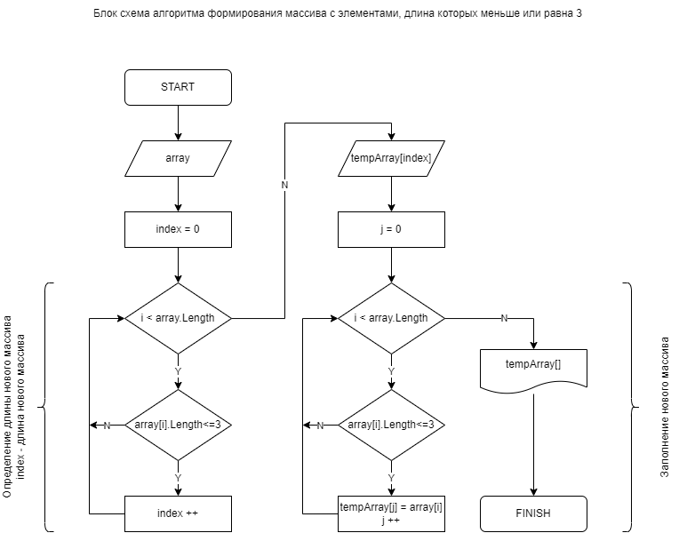

# ИТОГОВАЯ КОНТРОЛЬНАЯ РАБОТА ПО ОСНОВНОМУ БЛОКУ

## _ЗАДАЧА_

Написать программу, которая из имеющегося массива строк формирует новый массив из строк, длина которых меньше, либо равна 3 символам. Первоначальный массив можно ввести с клавиатуры, либо задать на старте выполнения алгоритма. При решении не рекомендуется пользоваться коллекциями, лучше обойтись исключительно массивами.

## _РЕШЕНИЕ_

1. Для решения данной задачи, на основе составленной блок-схемы, написана программа, формурующая из заданного исходного массива строк новый массив строк с элементами, длина которых меньше или равна трем символам.

2. Программой выполняется проверка наличия элементов массива с длиной меньше или равным трем символам и определения их количества, для задания длины нового массива.

3. Новый массив строк формируется путем заполнения элементами исходного массива, соответствующими условию задачи - длина элементов нового массива строк должна быть меньше или равна трем символам.